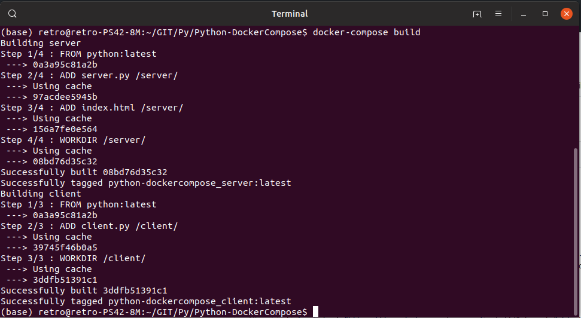
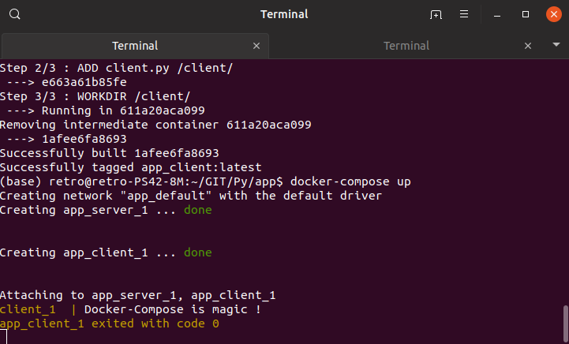

# Python-DockerCompose
Deploy a web service (client side / server side ) in python, with docker-compose.

<h3>  :octopus: What we talking about ? </h3>

On this repository I let a structure ready to build and use with a only two command.

That offer you to use a python client and server side on a web service, I followed the link below to write my structure.

 :link: <a href="https://www.freecodecamp.org/news/a-beginners-guide-to-docker-how-to-create-a-client-server-side-with-docker-compose-12c8cf0ae0aa/?source=rss----336d898217ee---4" target="_blank">Freecodecamp article. </a>

 

:warning: Notice that you need two things to use this structure, python ( version 3.7 ), and docker-compose 

:link: <a href="https://docs.docker.com/compose/install/" target="_blank"> Install docker-compose

  
  
<h3>  :rocket: Build and Deploy </h3>

 Let's begin by downloading the repository and move into the folder named <b> Python-DockerCompose
 </b> with your cli, you also can find a nmae for this folder who make more sense for you.

Well two command, and the first one is : 

<code>docker-compose build </code> 

Which is return : 

Now we finish this by : 

<code> docker-compose up </code>

 Which is return : 

          

:tada: is done ! 

