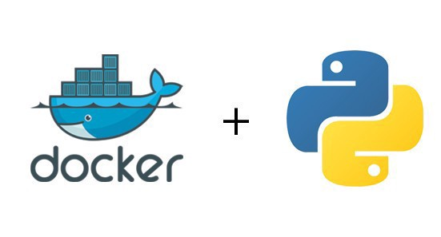

# Python-DockerCompose

<h3>  :octopus: What we talking about ? </h3>

On this repository I let a structure ready to build and use with only two command.

That offer you to use a python environement with Django and Postgre.

I followed the link below to build this environement, so if your lost or confuse you may be should take a look on the documentation 

 :link: <a href="https://docs.docker.com/compose/django/a" target="_blank">Docker compose. </a>

 

<h3> :squirrel: What do we need ? </h3>

This environement only need a working docker compose version, you can do the command :  
 
<code>docker-compose -v </code> 
<i> And checkout if you already have a docker-compose on your system, if not, you can follow the guide below : </i>  
<a href="https://docs.docker.com/compose/install/">Docker-compose documentation </a>

